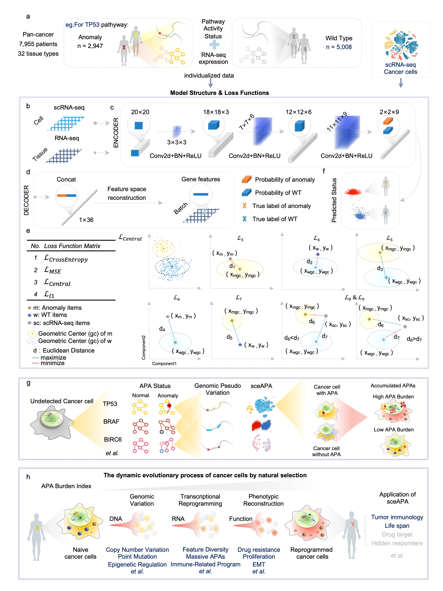

# sceAPA: evaluate anomaly pathway activity status of cancer cells in scRNA-seq 
As a core of the tumor niche, our understanding of functional programs and the nature of cancer cells remains rudimentary. One of the main reasons is strong transcriptional heterogeneity in cancer cells is much higher than that in non-cancer cells, which is kept researchers from further exploring the molecular basis and subtype of specific cancer as well as the progression trajectory of cancer cells. identifying cancerous anomaly activities is one of the essential aims of precision oncology. In this study, we applied a contrastive learning approach to analyze scRNA-seq data and developed a sceAPA (evaluation of Anomaly Pathway Activity) model to construct the spatial mapping correlation between RNA features and genomic variation-associated anomaly pathway activity (APA) in cancer cells. The dynamic transcriptional profile revealed by scRNA-seq is a real-time reflection of cancer cells reconfiguring the transcriptome pattern and developing varieties APAs in response to selective pressure to gain adaptive evolutionary advantage. The sceAPA could capture weak signals of APAs within cancer cells at the single-cell-single-gene resolution and analyze the adaptive evolutionary advantages that APA diversity confers on cancer single cells under different selective pressures. sceAPA could detect various cancer-related factors (coding genes, non-coding regions, pseudogenes) associated APAs patterns at the single cell level. Clinically, sceAPA can be widely used to evaluate hidden responders of current targeted therapies, novel individualized therapeutic strategies, and drug combinations in tissue and liquid biopsy fields.

> 作为肿瘤生态位的核心，我们对癌细胞的功能程序和性质的理解仍然很不成熟。主要原因之一是癌细胞中强烈的转录异质性远远高于非癌细胞，这使得研究人员无法进一步探索特定癌症的分子基础和亚型，以及癌细胞的进展轨迹。识别癌症的异常活动是精准肿瘤学的基本目标之一。在这项研究中，我们应用对比学习的方法来分析scRNA-seq数据，并开发了一个sceAPA（异常路径活动的评价）模型，以构建RNA特征与癌细胞中基因组变异相关的异常路径活动（APA）之间的空间映射关系。scRNA-seq所揭示的动态转录特征实时反映了癌细胞为获得适应性进化优势而在选择压力下重新配置转录组模式和发展品种APA。sceAPA可以在单细胞-单基因分辨率下捕获癌细胞内APA的微弱信号，并分析APA多样性在不同选择压力下赋予癌症单细胞的适应性进化优势。sceAPA可以在单细胞水平检测与APA模式相关的各种癌症相关因素（编码基因、非编码区、假基因）。在临床上，sceAPA可广泛用于评估当前靶向治疗、新型个体化治疗策略以及组织和液体活检领域的药物组合的隐藏反应者。

<div align='center' ><b><font size='150'>Overview of sceAPA</font></b></div>
  


## All ref data 

> LINK: https://pan.baidu.com/s/1NOslCiNb6vGIeYSeyYKRow  PWD: i556

## Pre-requisites:

- Linux (Based on Ubuntu 20.04 LTS, Personal Computer) 
- CPU AMD Ryzen 9 3950X
- NVIDIA GeForce RTX 3090 24GB 384bit 1695MHz 19500MHz 
- Memory 128G (32GB*4) DDR4 3200MHz

### Environment and resource allocation

---

For instructions on installing anaconda on your machine (download the distribution that comes with python 3):
https://www.anaconda.com/distribution/

```
#conda env create -n CaSee -f configs/CaSee_env_info.yaml

# if there are some warnings or errors 
# you can manually install some main packages
# all pip software in all_pip_pacakges.yaml
conda create -n CaSee python==3.8.8 # python==3.8
conda activate CaSee

pip install pytorch-lightning==1.3.7 # -i https://pypi.tuna.tsinghua.edu.cn/simple
pip install scipy==1.7.0 # -i https://pypi.tuna.tsinghua.edu.cn/simple
pip install numpy==1.20.3 # -i https://pypi.tuna.tsinghua.edu.cn/simple
pip install scanpy==1.7.2 # -i https://pypi.tuna.tsinghua.edu.cn/simple
pip install scikit-learn==0.23.2 # -i https://pypi.tuna.tsinghua.edu.cn/simple
pip3 install opencv-python==4.5.2.54 # -i https://pypi.tuna.tsinghua.edu.cn/simple
pip install torchmetrics==0.3.2 # -i https://pypi.tuna.tsinghua.edu.cn/simple
pip install torchvision==0.10.0 # -i https://pypi.tuna.tsinghua.edu.cn/simple

```

And you also download pytorch https://pytorch.org/ 

Attention, if you in the Chinese mainland, plz use `pip install` instand `conda install` 

**Ubuntu**

```
pip3 install torch==1.9.0+cu111 torchvision==0.10.0+cu111 torchaudio==0.9.0 -f https://download.pytorch.org/whl/torch_stable.html


```

**MacOS**

```
pip3 install torch==1.9.0 torchvision==0.10.0 torchaudio==0.9.0


```

**Windos**

```
pip3 install torch==1.9.0+cu111 torchvision==0.10.0+cu111 torchaudio==0.9.0 -f https://download.pytorch.org/whl/cu111/torch_stable.html
```
> torch==1.9.0+cu111  
> torchvision==0.10.0+cu111  
> torchaudio==0.9.0
> ## Prepare candidate ref data

Download `ref_data.tar.xz` and unzip the file, move the whole `ref_data` into the CaSee program work_dir.


## Running Model

```
python ScMutation.py \
    -g $genes \
    -s 'ref/GSE116237_Candidate_cancer_expr.h5' \
    -b 'ref/scMutation_ref.h5' \
    -o 'Pan_cancer_Pathyway_detection/GSE116237/Pan_cancer_'$id \
    --lr 1e-4 \
    --batch_size 128 \
    --max_epoch 100 \
    --n_neighbors_pseudo 30 \
    --cl_weight 0.895
```
